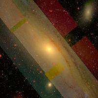

# SDSS-Imaging-API
Image API implementation for acquiring SDSS images based on coordinates, object names, or random selections via a GUI.

<p align="center"> <a href="https://how-to-help-ukraine-now.super.site" target="_blank">  </a>

# Features

This application allows you to:
- Input **J2000 Equatorial Coordinates** (`RA` and `DEC` in decimal format) to fetch an SDSS image.
- Provide an **Object Name** to resolve its coordinates and fetch its image.
- Select a **Random Object** from the NGC database, which will resolve its coordinates and download an image if it falls within the SDSS footprint.

For acquiring SDSS DR16 images from [SDSS Navigate](http://skyserver.sdss.org/dr16/en/tools/chart/navi.aspx?), several parameters are required:
- **Coordinates** (`RA` and `DEC`) or an object name.
- **Image Scale** (default value `1`).
- **Image Dimension**, with default value 200 x 200 px.

Run the `app.py` with `streamlit run app.py` and then use the GUI to input parameters and download images.

# Usage

1. Clone the repository and navigate to the project folder.
2. Install the required Python libraries:
   ```bash
   pip install -r requirements.txt
   ```
3. Run the Streamlit app:
   ```bash
   streamlit run app.py
   ```
4. Use the GUI to select one of the following modes:
   - **RA and Dec**: Input coordinates in decimal format.
   - **Object Name**: Provide a celestial object name (e.g., "M31").
   - **Random Object**: Let the app select a random object from the NGC database.

# Checklist

- [x] Initial API
- [x] GUI Implementation
- [x] Support for Random Object Selection
- [x] Object Name Resolution
- [ ] Add J2000 coordinate in `DD:MM:SS` or `DD MM SS`
- [ ] Add read from `.txt`
- [ ] Add spectra acquisition

# Example: M31

To acquire an image of the Andromeda Galaxy (M31):

1. Launch the app and select **Object Name** from the dropdown menu.
2. Enter "M31" in the input box.
3. Set the desired image scale and dimensions.
4. Click "Download Image".

Alternatively, select **Random Object** to let the app choose a random object and download its image automatically if it falls within the SDSS footprint.

**Example Result:**



# Reference
- SDSS DR16: http://skyserver.sdss.org/dr16/en/home.aspx
- OpenNGC Database: https://github.com/mattiaverga/OpenNGC
