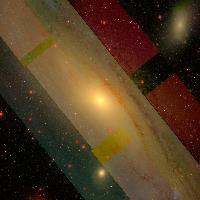

# SDSS-Imaging-API
Image API implementation for acquiring SDSS image based on coordinates

# Usage

First, look for any catalogue for object coordinate, in example [Simbad](https://simbad.u-strasbg.fr/simbad/sim-fbasic).
For acquiring SDSS DR16 image from `SDSS Navigate`, several parameters required:
* **Coordinate** of `RA` and `DEC` (currently only available on decimal)
* **Image Scale** of SDSS (default value `1`)
* **Image Dimension** , with default value 200 x 200 px.

Run the `app.py` with `python app.py` and then insert the desired parameters. 

# Example: M31

To acquire M31 image, which is very close in extragalactic scale. 

```
python app.py 
>>> RA and dec in decimal [RA] [DE] : 10.6847 41.268
>>> Enter the image scale (float, default 1): 20
>>> Enter the image dimension (int, default 200 px): 
>>> img_RAJ_10.6847_DEJ_41.268.jpg  downloaded
```

**Here you go!**




# Reference
SDSS DR16, http://skyserver.sdss.org/dr16/en/home.aspx
